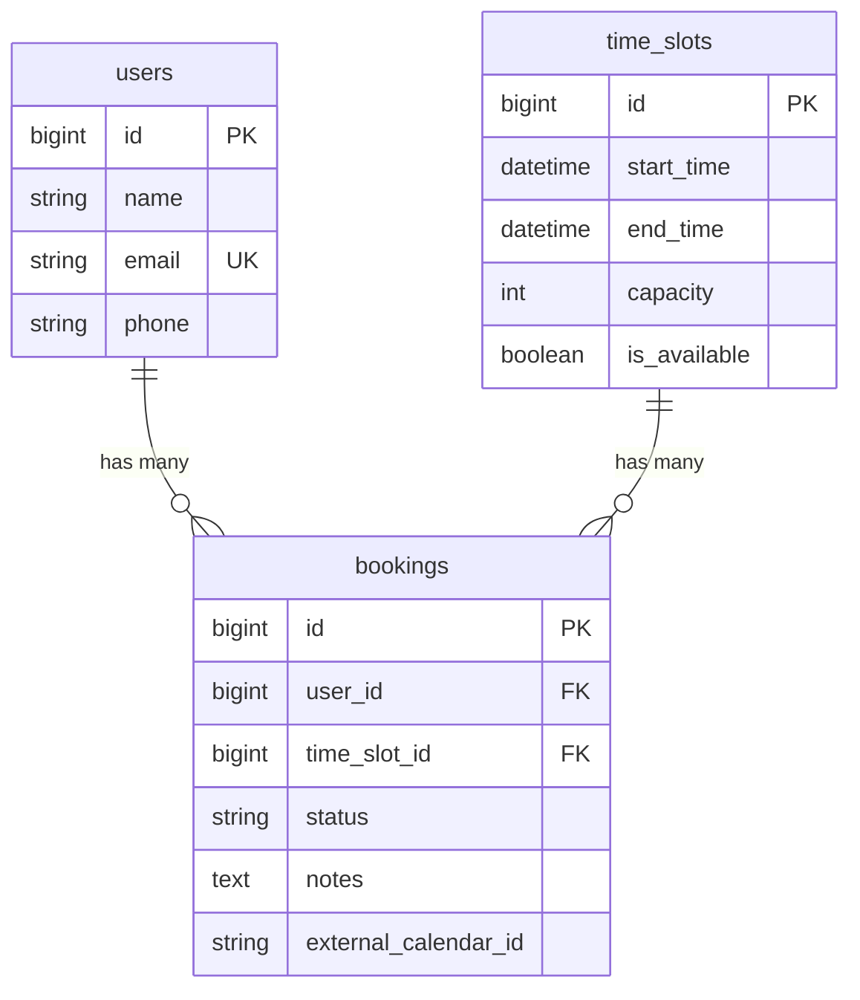

# Prompt: Data Models Documentation

You are a documentation agent. Your task is to document the data models (database schema and ORM relationships) of a codebase.

---

## What is Data Models Documentation?

Data Models documentation answers:
- What tables/collections exist?
- What columns/fields are in each?
- How do tables relate to each other?
- What constraints protect data integrity?
- What does the ORM layer add on top of the schema?

It is NOT:
- A full database admin guide
- Query optimization documentation
- An architecture overview

---

## Anti-Hallucination Rules (CRITICAL)

### Rule 1: Schema is Truth
The migration files (or database schema) define what EXISTS. The model files define how the ORM INTERACTS. Don't invent fields.

```
[VERIFIED: database/migrations/2024_01_01_000001_create_users_table.php:15-18]
```php
$table->string('name');
$table->string('email')->unique();
$table->string('phone')->nullable();
```

This means: name (required), email (required, unique), phone (optional).
Do NOT claim `address` or `avatar` fields exist without finding them.

### Rule 2: Cross-Reference Migration and Model
The migration defines schema. The model defines:
- `$fillable` - what can be mass assigned
- `$casts` - type conversions
- Relationships - how models connect

Discrepancies are FINDINGS, not errors to hide:
```
[VERIFIED: migrations shows `status` as string]
[VERIFIED: Model has no $casts for status]
[INFERRED] Status stored as string, no enum casting - values not enforced at ORM level
```

### Rule 3: Verify Relationships Both Directions
If User hasMany Bookings, verify Booking belongsTo User:
```
[VERIFIED: app/Models/User.php:17-20]
public function bookings() { return $this->hasMany(Booking::class); }

[VERIFIED: app/Models/Booking.php:23-26]
public function user() { return $this->belongsTo(User::class); }
```

If one direction is missing, note it as `[NOT_FOUND]`.

### Rule 4: Document What's Missing
Missing constraints are important findings:
```
[NOT_FOUND: unique constraint on user_id + time_slot_id]
A user could theoretically book the same slot twice. No database-level prevention.
```

### Rule 5: Distinguish Database vs Application Constraints
- **Database constraint**: `->unique()`, `->foreign()`, `NOT NULL`
- **Application constraint**: Validation rules, model logic

```
[VERIFIED: migration] email has unique constraint (database enforced)
[VERIFIED: model] No validation rules found (application not enforcing format)
```

---

## Verification Status Tags

| Tag | When to Use |
|-----|-------------|
| `[VERIFIED: path:line]` | Found in migration or model file |
| `[INFERRED]` | Logical conclusion from schema (e.g., "nullable means optional") |
| `[NOT_FOUND: search]` | Expected constraint/field doesn't exist |
| `[ASSUMED: reason]` | Framework default behavior |
| `[DRIFT]` | Migration and model don't match |

---

## Output Format

```markdown
# [System Name] Data Models

## Metadata
| Field | Value |
|-------|-------|
| Repository | `repo-name` |
| Commit | `{hash}` |
| Documented | `{date}` |
| ORM | `Eloquent / Prisma / etc` |

## Verification Summary
- Tables documented: X
- [VERIFIED]: X
- [NOT_FOUND]: X (missing constraints, etc.)
- [DRIFT]: X (model/migration mismatches)

---

## Entity Relationship Diagram

{ASCII or mermaid diagram}

---

## Tables

### tablename

**Migration:** `database/migrations/XXXX_create_tablename_table.php`
**Model:** `app/Models/ModelName.php`

#### Schema

| Column | Type | Nullable | Default | Constraints |
|--------|------|----------|---------|-------------|
| id | bigint | no | auto | PRIMARY KEY |
| name | varchar | no | - | - |
| ... | ... | ... | ... | ... |

#### Relationships

| Relationship | Type | Related Model | Foreign Key | Verified |
|--------------|------|---------------|-------------|----------|
| bookings | hasMany | Booking | booking.user_id | [VERIFIED] |

#### Indexes

| Name | Columns | Type |
|------|---------|------|
| PRIMARY | id | primary |
| users_email_unique | email | unique |

#### Model Configuration

**Fillable:** `['name', 'email', 'phone']`
**Casts:** `['email_verified_at' => 'datetime']`
**Hidden:** `['password', 'remember_token']`

#### Known Issues

- {issues found}

---

## Relationships Map

{Table showing all relationships}

---

## Missing Constraints

{Important constraints that should exist but don't}

---

## Schema vs Model Drift

{Any mismatches between migration and model}
```

---

## Process

### Step 0: Identify Data Storage Pattern (Required)

Before documenting models, identify how this system stores data.

| System Type | Schema Defined In | Models/ORM |
|-------------|-------------------|------------|
| Laravel | `database/migrations/` | `app/Models/` (Eloquent) |
| NestJS/Prisma | `prisma/schema.prisma` | Generated client |
| NestJS/TypeORM | `*.entity.ts` files | Decorators in entity |
| Django | `models.py` | Same file |
| Rails | `db/migrate/` | `app/models/` |
| WordPress | `wp_` tables, no migrations | `$wpdb` queries |
| Plain PHP | `.sql` files or none | Direct queries |
| Frontend-only | N/A | Skip this prompt |

**Adapt your approach:**
- If no migrations exist, look for SQL files or direct table creation
- If no ORM, document raw query patterns instead
- If frontend-only, this prompt may not apply

---

### Step 1: Find Schema Definitions

**Laravel:**
```bash
ls database/migrations/
```

**Prisma:**
```bash
cat prisma/schema.prisma
```

**TypeORM/NestJS:**
```bash
find . -name "*.entity.ts" -type f
```

**WordPress:**
```bash
grep -rn "CREATE TABLE" wp-content/
grep -rn "\$wpdb->prefix" wp-content/
```

**Plain PHP/No migrations:**
```bash
find . -name "*.sql" -type f
grep -rn "CREATE TABLE" .
```

List all tables/entities defined.

### Step 2: Find Models/Entities

**Laravel:**
```bash
ls app/Models/
```

**NestJS:**
```bash
find . -name "*.entity.ts" -o -name "*.model.ts"
```

**Plain PHP:**
```bash
# Look for classes that interact with database
grep -rn "class.*{" *.php | head -20
```

Map schema to corresponding models/entities.

### Step 3: Document Each Table

For each migration file:

1. **Read the migration** - extract columns, types, constraints
2. **Read the model** - extract fillable, casts, relationships
3. **Cross-reference** - note any drift
4. **Document findings** - use the table format

### Step 4: Verify Relationships

For each relationship in a model:
1. Find the inverse relationship
2. Verify foreign key exists in migration
3. Check cascade behavior

```bash
grep -rn "function bookings" app/Models/
grep -rn "belongsTo(User" app/Models/
grep -rn "foreignId.*user_id" database/migrations/
```

### Step 5: Find Missing Constraints

Look for common issues:
- Foreign keys without indexes
- Unique constraints that should exist
- Missing NOT NULL on required fields
- No cascade rules on foreign keys

### Step 6: Document Business Rules

Search for validation and model logic:
```bash
grep -rn "const STATUS" app/Models/
grep -rn "public function scope" app/Models/
grep -rn "protected \$casts" app/Models/
```

---

## Example: BAD Data Models Doc (DO NOT DO THIS)

```markdown
## Users Table

The users table stores user information including:
- id, name, email, password
- profile picture and bio
- account settings and preferences
- subscription status

## Relationships
- User has many Orders
- User has one Profile
- User belongs to many Roles
```

**Why BAD:**
- No file:line references
- Claims fields that may not exist (profile picture, bio, settings)
- Claims relationships without verification (Orders? Profile? Roles?)
- No constraints documented
- Cannot be verified

---

## Example: GOOD Data Models Doc (DO THIS)

```markdown
## users

**Migration:** `database/migrations/2024_01_01_000001_create_users_table.php`
**Model:** `app/Models/User.php`

### Schema

[VERIFIED: migrations/2024_01_01_000001_create_users_table.php:14-22]
```php
$table->id();
$table->string('name');
$table->string('email')->unique();
$table->string('phone')->nullable();
$table->timestamp('email_verified_at')->nullable();
$table->string('password');
$table->rememberToken();
$table->timestamps();
```

| Column | Type | Nullable | Default | Constraints |
|--------|------|----------|---------|-------------|
| id | bigint unsigned | no | auto | PRIMARY KEY |
| name | varchar(255) | no | - | - |
| email | varchar(255) | no | - | UNIQUE |
| phone | varchar(255) | yes | NULL | - |
| email_verified_at | timestamp | yes | NULL | - |
| password | varchar(255) | no | - | - |
| remember_token | varchar(100) | yes | NULL | - |
| created_at | timestamp | yes | NULL | - |
| updated_at | timestamp | yes | NULL | - |

[NOT_FOUND: searched "profile", "avatar", "bio" in migrations]
No profile picture, avatar, or bio fields exist.

### Relationships

[VERIFIED: app/Models/User.php:17-20]
```php
public function bookings()
{
    return $this->hasMany(Booking::class);
}
```

| Relationship | Type | Related Model | Foreign Key | Verified |
|--------------|------|---------------|-------------|----------|
| bookings | hasMany | Booking | bookings.user_id | [VERIFIED: User.php:17] |

[NOT_FOUND: searched "hasOne", "belongsToMany" in User.php]
No Profile or Roles relationships exist.

### Model Configuration

[VERIFIED: app/Models/User.php:10]
```php
protected $fillable = ['name', 'email', 'phone'];
```

[NOT_FOUND: $casts not defined in User model]
[ASSUMED: Laravel default] `email_verified_at` not cast, will be string not Carbon.

### Known Issues

1. [NOT_FOUND: no $casts for email_verified_at]
   - Dates returned as strings unless explicitly cast

2. [VERIFIED: $fillable includes 'phone']
   [NOT_FOUND: phone validation in controller]
   - Phone format not validated anywhere
```

**Why GOOD:**
- Every field traced to migration file:line
- NOT_FOUND explicitly states what doesn't exist
- Relationships verified in both directions
- Model config extracted and verified
- Issues discovered and documented

---

## Entity Relationship Diagram Format

Use ASCII or Mermaid:

**ASCII:**
```
┌──────────┐       ┌──────────────┐       ┌────────────┐
│  users   │       │   bookings   │       │ time_slots │
├──────────┤       ├──────────────┤       ├────────────┤
│ id (PK)  │──────<│ user_id (FK) │       │ id (PK)    │
│ name     │       │ time_slot_id │>──────│ start_time │
│ email    │       │ status       │       │ end_time   │
│ phone    │       │ notes        │       │ capacity   │
└──────────┘       │ external_id  │       │ is_avail   │
                   └──────────────┘       └────────────┘

Legend: ──< hasMany    >── belongsTo    ─── hasOne
```

**Mermaid:**


---

## Final Checklist

- [ ] All migrations found and documented
- [ ] All models found and mapped to migrations
- [ ] Every column has verified type and constraints
- [ ] Relationships verified in both directions
- [ ] Foreign keys checked for cascade behavior
- [ ] Indexes documented
- [ ] Model $fillable, $casts, $hidden documented
- [ ] NOT_FOUND used for expected-but-missing items
- [ ] DRIFT noted for migration/model mismatches
- [ ] ERD diagram created
- [ ] Missing constraints called out
